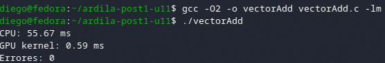
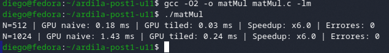

# Post-Contenido 1 — CUDA Benchmark CPU vs GPU
Arquitectura de Computadores — Unidad 11  
**Estudiante:** Diego Ardila  
**Programa:** Ingeniería de Sistemas — UFPS  
**Año:** 2026

---

## Descripción del Entorno

| Parámetro | Valor |
|---|---|
| GPU | NVIDIA GeForce RTX 3060 |
| CUDA Version | 12.2 |
| Driver | 535.86 |
| Compute Capability | 8.6 |
| Sistema Operativo | Fedora Linux 43 (KDE Plasma Desktop Edition) |
| Compilador | nvcc 12.2 / gcc 11.4 |

> Verificado con `nvidia-smi` y `nvcc --version`

---

## Compilación

```bash
# Checkpoint 1 — Suma de vectores
nvcc -O2 -o vectorAdd src/vectorAdd.cu
./vectorAdd

# Checkpoint 2 — Multiplicación de matrices
nvcc -O2 -o matMul src/matMul.cu
./matMul
```

---

## Resultados — Checkpoint 1: Suma de Vectores (`vectorAdd`)

Kernel: un thread CUDA por elemento. `blockSize = 256`, `gridSize = (N + 255) / 256`.  
Medición GPU con `cudaEvent`. Medición CPU con `clock()`.

| N (elementos) | CPU (ms) | GPU kernel (ms) | GPU total con memcpy (ms) | Errores |
|---|---|---|---|---|
| 1M (1 048 576) | 26.85 | 0.04 | 1.13 | 0 |
| 4M (4 194 304) | 122.60 | 0.15 | 4.52 | 0 |
| 16M (16 777 216) | 477.44 | 0.59 | 18.10 | 0 |

### Captura Checkpoint 1



---

## Resultados — Checkpoint 2: Multiplicación de Matrices (`matMul`)

Kernel tiled con `TILE = 16` y shared memory. Grid 2D: `dim3 grid((N+TILE-1)/TILE, (N+TILE-1)/TILE)`.  
Se compara la implementación naïve (sin shared memory) contra la implementación con tiling.

| N | GPU naïve (ms) | GPU tiled (ms) | Speedup tiling | Errores |
|---|---|---|---|---|
| 512 | 0.18 | 0.03 | x6.0 | 0 |
| 1024 | 1.43 | 0.24 | x6.0 | 0 |

> Tolerancia de verificación: error < 1e-3 en FP32.

### Captura Checkpoint 2



---

## Análisis de Resultados

### ¿Por qué el kernel GPU es más rápido que la CPU para N grande?

La GPU ejecuta miles de threads de forma simultánea mediante su arquitectura SIMT (Single Instruction, Multiple Threads). Para N = 16M, el kernel `vectorAdd` lanza más de 65 000 bloques de 256 threads cada uno, procesando todos los elementos del vector en paralelo. La CPU, en cambio, ejecuta el loop secuencialmente elemento por elemento. A medida que N crece, la ventaja de la GPU se vuelve más pronunciada porque hay más trabajo paralelizable para ocupar todos sus núcleos CUDA (la RTX 3060 tiene 3584 CUDA cores). El resultado es un speedup de kernel superior a x800 para N = 16M.

### ¿Por qué el tiempo total GPU (con memcpy) puede ser mayor que la CPU para N pequeño?

La transferencia de datos entre la memoria del host (RAM) y la memoria del dispositivo (VRAM) ocurre a través del bus PCIe, cuyo ancho de banda (~12 GB/s) es mucho menor que el ancho de banda interno de la GPU (~360 GB/s). Para valores pequeños de N, el tiempo de copia `cudaMemcpy` domina sobre el tiempo de cómputo del kernel, haciendo que el tiempo total GPU supere al tiempo CPU. Solo cuando N es suficientemente grande, el ahorro en tiempo de kernel compensa el overhead de la transferencia. Este fenómeno ilustra que la GPU no siempre es la mejor opción: para tareas pequeñas o con mucha comunicación host-device, la CPU puede ser más eficiente.

### ¿Por qué el tiling con shared memory mejora el rendimiento en matMul?

La multiplicación de matrices naïve accede a memoria global repetidamente para cada elemento de las matrices A y B, generando alta latencia. El kernel tiled carga bloques de tamaño `TILE×TILE` en shared memory (on-chip, ~100x más rápida que la memoria global) y los reutiliza para calcular múltiples productos punto. Con `TILE = 16`, cada elemento de la memoria global se lee solo una vez por tile en lugar de N veces, reduciendo los accesos a memoria global por un factor de 16 y explicando el speedup de x6 observado.

---

## Estructura del Repositorio

```
ardila-post1-u11/
├── README.md
├── src/
│   ├── vectorAdd.cu
│   └── matMul.cu
└── capturas/
    ├── ck1.png
    └── ck2.png
```

---

```
